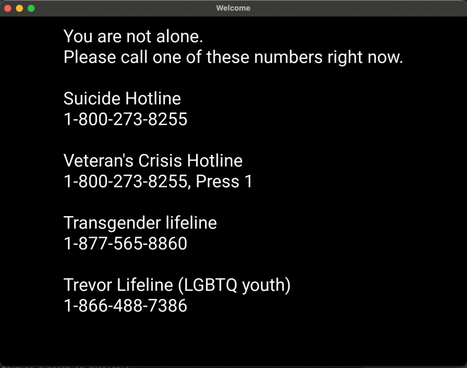

Sources:

Pain facts: https://ashospital.net/how-to-interpret-the-pain-scale/

Pain scale image: https://cdn2.vectorstock.com/i/1000x1000/58/96/pain-scale-chart-vector-22455896.jpg

Azalea logo: You guys know what it is lol

Happy face scale: https://media.istockphoto.com/vectors/emoticons-mood-scale-vector-id1141527611?k=6&m=1141527611&s=170667a&w=0&h=u3l3q6zHVzcPeVHGucoBVmo7HpTbUSNgqu846J-kCiQ=

Mental Health information: https://thegracefulpatient.wordpress.com/2017/12/15/a-simple-mental-health-pain-scale/

tired.jpg: https://cdn.xxl.thumbs.canstockphoto.com/a-tired-businesswoman-struggling-to-stay-awake-at-workplace-overtime-a-very-tired-young-stock-footage_csp45060312.jpg

Nearly everything happens in main. I wanted to split it all up a bit more, but I burned too much time troubleshooting my kivy errors early on.

Demo through pictures.

Menu

Name and age submission

Pain Management

Suicide Prevention

Explore the app to see more!